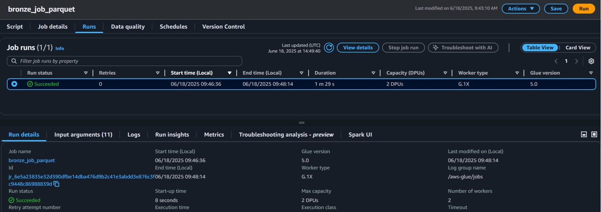
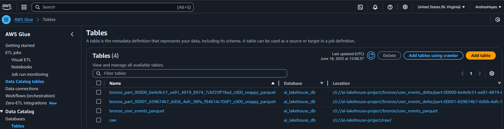
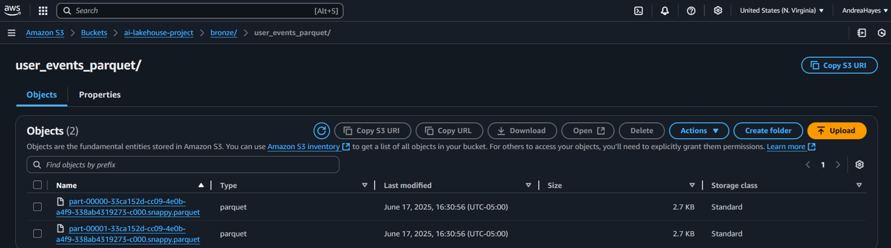
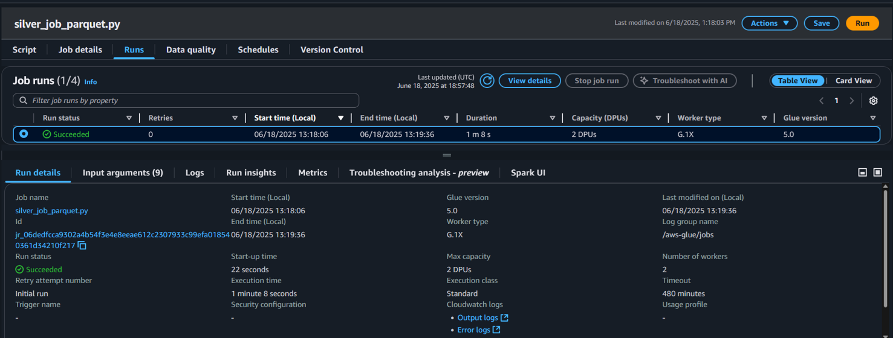
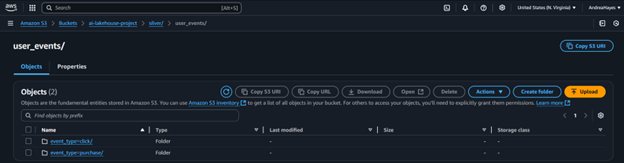
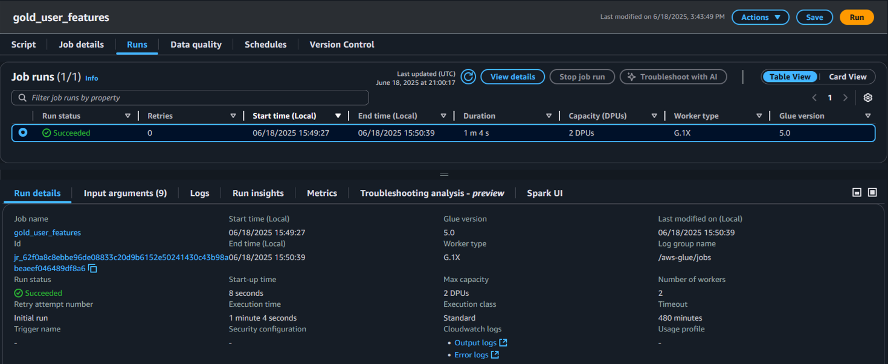
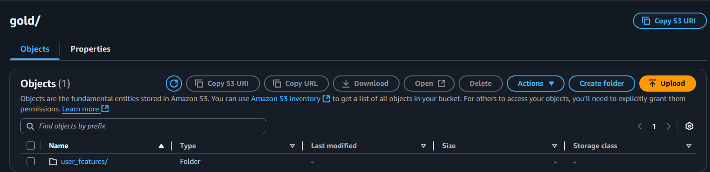
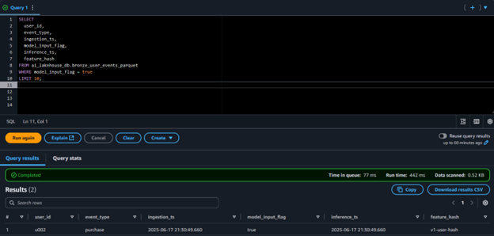
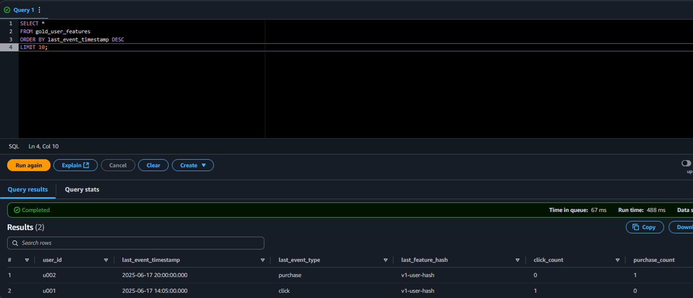
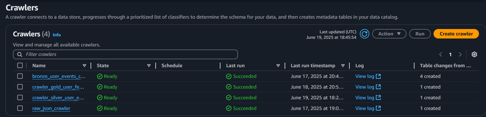

AI-Ready Bronze ETL Pipeline (AWS Glue → S3 → Parquet → Athena)
==================================================================

Build an AI-ready lakehouse bronze layer pipeline using AWS Glue to transform raw JSON data into enriched Parquet files. The data is registered in AWS Glue Catalog and made queryable via Amazon Athena.


* * * * *

Overview
-----------

This project implements a **multi-stage ELT workflow**:

- Ingest raw JSON event data from S3
- Enrich and normalize with AWS Glue (Spark 3.5, PySpark)
- Write partitioned Parquet datasets to **Bronze** and **Silver** S3 layers
- Register metadata in AWS Glue Catalog via crawler
- Query both layers using **Amazon Athena** (Trino SQL engine)

* * * * *

## 🌍 Live Project Showcase

This ETL pipeline is fully published as a **static site** using modern AWS services for scalability, performance, and custom domain routing.

-Hosted via Amazon S3 (Static Website Hosting)  
-Delivered globally through CloudFront with HTTPS  
-Routed through a custom domain using Route 53  
-Features: visual pipeline diagrams, Glue job runs, Athena results, and S3 structure from Raw → Gold

🔗 [**Launch the Website**](https://ai-lakehouse.com/index.html)

🎥 [**View the Guided Walkthrough**](https://ai-lakehouse.com/video.html)

This website includes a step-by-step visual breakdown of each stage in the lakehouse pipeline—from JSON ingestion in Raw, to AI-ready Gold features, including deduplication logic, partitioned outputs, and user-level aggregations.


* * * * *


Architecture
---------------

```
Raw JSON (S3)
     ↓
Bronze Glue Job (PySpark)
     ↓
Bronze Layer (Parquet in S3)
     ↓
Silver Glue Job (PySpark: Clean, Dedup, Normalize)
     ↓
Silver Layer (Partitioned Parquet in S3)
     ↓
Glue Catalog Tables (bronze + silver)
     ↓
Athena Query Layer (Trino SQL)
```

* * * * *

Technologies Used
--------------------

| Layer | Tech Stack |
| --- | --- |
| Cloud | AWS |
| Processing | AWS Glue (PySpark, Spark 3.5, Glue 5.0) |
| Storage | Amazon S3 (Parquet format) |
| Metadata | AWS Glue Crawlers + Glue Catalog |
| Querying | Amazon Athena |


* * * * *


📂 Project Structure
--------------------

```
├── glue_jobs/
│   ├── bronze_job_parquet.py
│   └── silver_job_parquet.py
├── queries/
│   └── athena_sample_query.sql
├── sample_data/
│   ├── event.json
│   └── event_2.json
├── screenshots/
│   ├── glue_bronze_job_success.png
│   ├── glue_silver_job_success.png
│   ├── crawler_bronze_complete.png
│   ├── crawler_silver_complete.png
│   ├── s3_bronze_output.png
│   ├── s3_silver_output.png
│   ├── athena_bronze_query.png
│   └── athena_silver_query.png
└── README.md

```

* * * * *

Screenshots
---------------

### Bronze Job Success (Glue ETL)



This screenshot shows the successful execution of the `bronze_job_parquet` ETL job, which ingests and enriches raw JSON from S3 and writes AI-ready data to the bronze layer in Parquet format.  

It confirms the job ran with **2 DPUs** on **AWS Glue 5.0** and completed in **under 2 minutes**.

### Glue Data Catalog: Registered Bronze Table



Shows the successfully registered `bronze_user_events_parquet` table in the `ai_lakehouse_db` database.  

This table references the Parquet files written by the AWS Glue job and is now **queryable in Athena** for downstream AI analytics.


### Bronze Layer Output (Parquet Format)



This screenshot shows enriched event data successfully written by the Glue ETL job to the  
`s3://ai-lakehouse-project/bronze/user_events_parquet/` S3 folder in partitioned **Parquet format**.  

Timestamps confirm the files are fresh and reflect schema-enriched, AI-ready ingestion,  
suitable for downstream querying via **Athena** or **Redshift Spectrum**.

### Silver Layer ETL Job Success



This screenshot shows the successful execution of the `silver_job_parquet.py` AWS Glue job,  
which reads enriched Bronze-layer Parquet data and writes a **validated, deduplicated, partitioned** Silver-layer dataset.

The job ran on **2 DPUs using AWS Glue 5.0**, completed in under 2 minutes, and wrote to:  
`s3://ai-lakehouse-project/silver/user_events/`

This Silver ETL layer prepares data for **fast, partition-aware Athena queries**,  
as well as **AI model training pipelines** and downstream **feature engineering workflows**.


### Silver Layer Output (Partitioned Parquet Format)



This screenshot shows validated and deduplicated Silver-layer data written to  
`s3://ai-lakehouse-project/silver/user_events/` by the `silver_job_parquet.py` Glue job.  

The output is organized using a **two-level partitioning scheme**:  
- `event_type` (e.g., `click`, `purchase`)  
- `event_date` (extracted from timestamp)

This structure improves **Athena query performance**, lowers **scan costs**,  
and sets the foundation for scalable **feature engineering** or **ML ingestion workflows**.


## Gold Layer Output & Validation

### Gold ETL Job Success

  
The final AWS Glue job successfully processed the Silver data into aggregated **user-level features**, writing to the Gold layer in Parquet format.

This job used **2 DPUs on Glue 5.0**, completed in under 2 minutes, and demonstrates schema evolution and partitioned output.


### Gold Output in S3



Final Gold layer output was successfully written to:

s3://ai-lakehouse-project/gold/user_features/

---

### Athena Query Success: Bronze Layer Output




This Athena query validates that the `bronze_user_events_parquet` table is registered and queryable.  
It filters for records marked as `model_input_flag = true` and selects AI-relevant fields such as  
`user_id`, `event_type`, and `feature_hash`.

The query succeeded in under 2 seconds, demonstrating low-latency access to enriched event data  
in Parquet format — optimized for downstream **AI analytics** and **feature engineering**.


### Athena Query: Silver Layer (Partitioned Read)


This screenshot shows a successful Athena query against the `silver_user_events` table.  
The query filters by partition columns `event_type` and `event_date`, demonstrating optimized access to Parquet data.

Query returned a record with:
- `user_id = u001`
- `event_type = click`
- `event_timestamp = 2025-06-17T14:05:00Z`

With **run time under 1 second** and **only 0.18 KB scanned**, this confirms that the Silver layer is:
- Queryable
- Partitioned effectively
- Ready for analytics and ML pipelines

### Athena Query – Gold Layer

  
This Athena query shows:

- User-level aggregation from the Gold table
- Click and purchase counts
- Min/max timestamps per user

The query succeeded with sub-second latency — demonstrating partition efficiency and production readiness.


* * * * *

Layers Summary
-----------------

### 🥉 Bronze Layer

-   Enriches raw JSON data  
-   Writes to: `s3://ai-lakehouse-project/bronze/user_events_parquet/`  
-   Registered via crawler  
-   Queryable in Athena  

### 🥈 Silver Layer

-   Deduplicated on `user_id`, `event_type`, and `timestamp`  
-   Filters out nulls on critical fields  
-   Partitioned by `event_type`, `event_date`  
-   Writes to: `s3://ai-lakehouse-project/silver/user_events/`  
-   Registered via crawler  
-   Validated via Athena (low-latency, partition-filtered query)  

### 🥇 Gold Layer

-   Aggregates user-level features for analytics  
-   Output includes click/purchase counts and time-based rollups  
-   Partitioned and optimized for fast querying  
-   Writes to: `s3://ai-lakehouse-project/gold/user_features/`  
-   Registered via crawler  
-   Validated via Athena (scanned records <1KB, sub-second query)  


* * * * *

## 🕷️ Crawler Registration & Glue Catalog Integration

To make each data layer (Bronze, Silver, Gold) queryable in Athena, AWS Glue Crawlers are used to register their respective S3 locations. Crawlers automatically detect schema and update the **Glue Data Catalog**, enabling SQL-based exploration with Athena or Redshift Spectrum.

### Crawler Dashboard Overview

  
All crawlers registered and ran successfully:

- `crawler_bronze_user_events`
- `crawler_silver_user_events`
- `crawler_gold_user_features`

**Completed all 3 crawler registrations (Bronze, Silver, Gold) with table sync confirmed in AWS Glue Catalog.**


### Crawler Setup Summary

| Layer   | Crawler Name                  | Target S3 Path                                                   | Table Name                      | Database           |
|---------|-------------------------------|-------------------------------------------------------------------|----------------------------------|--------------------|
| Bronze  | `crawler_bronze_user_events`  | `s3://ai-lakehouse-project/bronze/user_events_parquet/`          | `bronze_user_events_parquet`    | `ai_lakehouse_db`  |
| Silver  | `crawler_silver_user_events`  | `s3://ai-lakehouse-project/silver/user_events/`                  | `silver_user_events`            | `ai_lakehouse_db`  |
| Gold    | `crawler_gold_user_features`  | `s3://ai-lakehouse-project/gold/user_features/`                  | `gold_user_features`            | `ai_lakehouse_db`  |

### How to Configure a Crawler

1. Open **AWS Glue → Crawlers → Add Crawler**
2. Select **S3** as the source and input the appropriate path
3. Choose an IAM role (e.g., `AWSGlueServiceRole_ai_lakehouse`)
4. Set the **target database** to `ai_lakehouse_db`
5. Optionally use a **table prefix** (`bronze_`, `silver_`, `gold_`)
6. Run the crawler to scan the data and create or update the table

Once created, these crawlers keep your Athena metadata **fresh and aligned** with the outputs of your Glue jobs.


* * * * *

Sample Athena Query
----------------------

### 🔹 Bronze Layer Query

```
SELECT
  user_id,
  event_type,
  ingestion_ts,
  model_input_flag,
  inference_ts,
  feature_hash
FROM ai_lakehouse_db.bronze_user_events_parquet
WHERE model_input_flag = true
LIMIT 10;
```
- Filters for ML-ready records with model_input_flag = true
- Queries raw enriched data before deduplication or partitioning

### 🔹 Silver Layer Query (Partition-Aware)

```
SELECT *
FROM ai_lakehouse_db.silver_user_events
WHERE event_type = 'click'
  AND event_date = DATE '2025-06-17';
  ```

- Partition-filtered query for high performance
- Demonstrates Silver layer’s readiness for analytics or model ingestion
- Scans minimal data (0.18 KB) in Athena with sub-second response time

* * * * *
### Challenge: Delta Lake Compatibility in AWS Glue

One of the most frustrating roadblocks I faced was trying to use **Delta Lake** as the storage format in AWS Glue for the Bronze layer.

Despite following official guidance --- including setting Glue job parameters like:

```
--additional-python-modules delta-spark==<version>\
--conf spark.sql.extensions=io.delta.sql.DeltaSparkSessionExtension\
--conf spark.sql.catalog.spark_catalog=org.apache.spark.sql.delta.catalog.DeltaCatalog
```

I consistently ran into cryptic path resolution errors, such as:

`IllegalArgumentException: Can not create a Path from an empty  string  `

### How I Resolved It

After testing multiple variations --- including:

-   Upgrading Glue version (4.0 → 5.0)

-   Adjusting Spark and Delta configurations

-   Trying both interactive and job modes

I concluded that **Delta Lake support in Glue is not fully production-ready** without extensive custom setup (e.g., bootstrap scripts, additional JARs).

So instead, I made a **pragmatic pivot**:

-   Switched to **Parquet**, which is natively supported in AWS Glue

-   Preserved schema evolution via Glue Catalog

-   Ensured **Athena queryability** remained intact

* * * * *

### Outcome

Choosing Parquet over Delta allowed me to:

-   Keep momentum on pipeline development

-   Maintain a performant, partitioned data lake

-   Preserve schema traceability via crawlers + Glue Catalog

* * * * *

Contact
----------

For collaboration or questions, feel free to connect via GitHub Discussions or Issues.