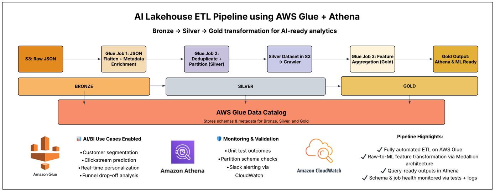
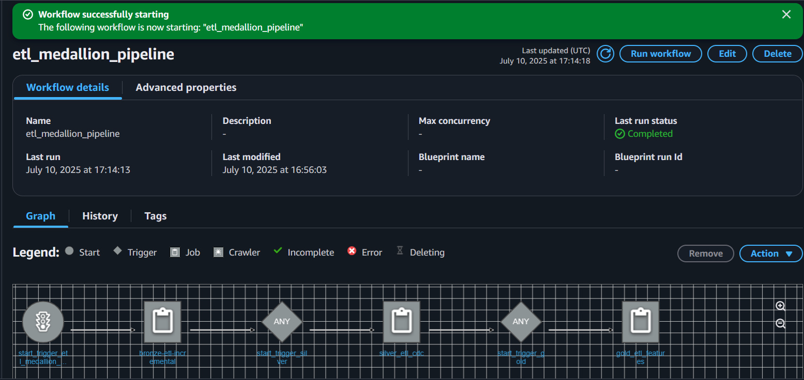
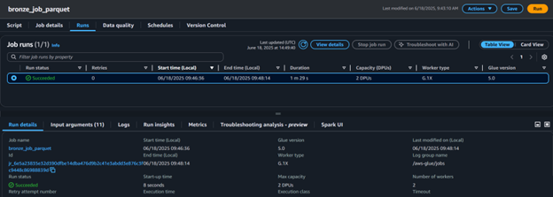
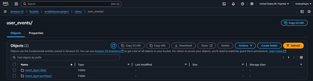
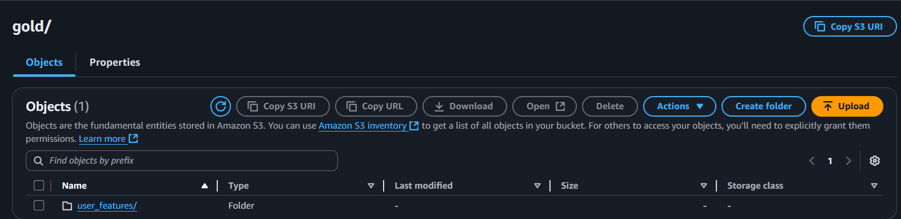
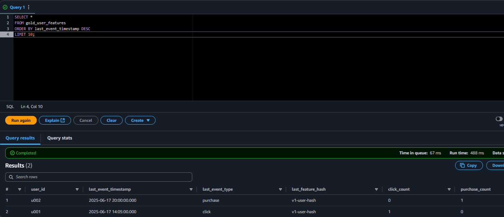
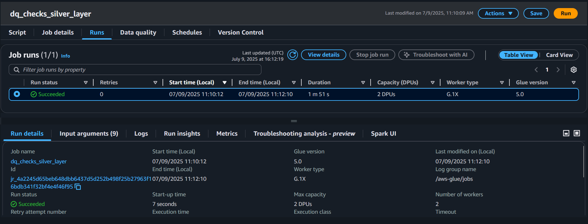
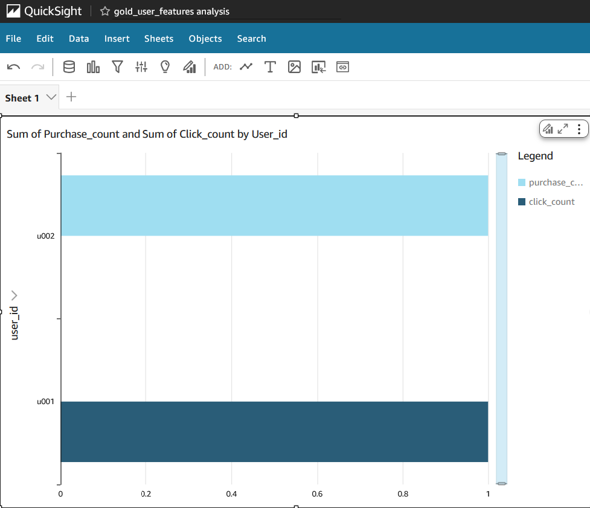

AI-Ready Bronze ETL Pipeline with Incremental + CDC Support
===========================================================

**Glue → S3 → Parquet → Athena**

This project implements an **AWS Glue-based medallion ETL pipeline** that processes clickstream JSON into **AI-ready Parquet datasets** with:

-   **incremental Bronze ingestion**
-   a **CDC-style data contract** (`pk`, `op`, `updated_at`)
-   **latest-wins resolution** with delete handling in Silver
-   **Gold user-feature generation** for analytics and ML
-   **data quality checks, audit logging, and freshness monitoring**
-   **Athena + QuickSight consumption** for downstream exploration


It is designed to demonstrate production-minded data engineering patterns using **AWS Glue, S3, Athena, and PySpark**.


Live Project
------------

This project is also published as a static site with diagrams, screenshots, and a walkthrough:

-   [Launch the Website](https://ai-lakehouse.com/index.html)
-   [View the Guided Walkthrough](https://ai-lakehouse.com/video.html)

* * * * *

Architecture
------------

Raw clickstream events are ingested incrementally, resolved into a current-state Silver dataset, and aggregated into Gold user features for analytics and ML.

### Architecture Diagram



* * * * *

Key Engineering Highlights
------------------------------

This project demonstrates the ability to:

-   design a **medallion ETL architecture** on AWS
-   implement **incremental and CDC-style processing**
-   handle **late-arriving updates and deletes**
-   produce **partitioned Parquet outputs** for low-cost querying
-   build **audit, quality, and freshness checks**
-   expose outputs for both **Athena analytics** and **QuickSight dashboards**
-   make pragmatic engineering tradeoffs when platform constraints appear

* * * * *


Core Stack
----------

| Area | Technology |
| --- | --- |
| Cloud | AWS |
| Processing | AWS Glue 5.0, PySpark, Spark 3.5 |
| Storage | Amazon S3, Parquet |
| Metadata | AWS Glue Crawlers, Glue Catalog |
| Query | Amazon Athena |
| BI | Amazon QuickSight |

* * * * *

Workflow Orchestration
----------------------

The full medallion pipeline is automated using **AWS Glue Workflows**, with Bronze → Silver → Gold dependencies orchestrated end to end.



> All stages completed successfully in sequence.

* * * * *

Layer Design
------------

### Bronze

The Bronze layer ingests raw clickstream JSON from S3 and writes enriched Parquet output.

Key behaviors:

-   incremental ingestion via `updated_at` watermark
-   deterministic `pk` generation using SHA2 hashing
-   CDC-style columns: `pk`, `op`, `updated_at`, `run_id`
-   append-only Bronze output for rerun safety

### Silver

The Silver layer resolves the active current-state dataset.

Key behaviors:

-   latest-wins logic using `ROW_NUMBER()`
-   delete handling with `op = 'D'`
-   null filtering on critical fields
-   partitioning by `event_type` and `event_date`
-   late-arriving event support using `updated_at`

### Gold

The Gold layer produces user-level features for downstream analytics and ML.

Example outputs:

-   `click_count`
-   `purchase_count`
-   `last_event_timestamp`
-   `last_event_type`
-   `days_since_last_event`

It also writes a lightweight audit log with row counts, run metadata, and freshness signals.

* * * * *

CDC Contract
------------

A major goal of this project was to simulate **incremental + CDC-style behavior** in a Glue/S3/Parquet environment.

| Column | Purpose |
| --- | --- |
| `pk` | Deterministic primary key for latest-wins resolution |
| `op` | Change type: insert, update, delete |
| `updated_at` | Ordering column for resolving current state |
| `run_id` | Audit/debugging identifier for the producing job |

This design allows downstream layers to support:

-   incremental processing
-   safe reruns
-   late-arriving updates
-   delete/tombstone handling
-   partition-based "merge-like" behavior without Delta Lake

* * * * *

Screenshots
-----------

### Bronze Job Success



Bronze runs incrementally, enriches raw events with metadata and hashes, and writes compressed Parquet output to S3. This job completed successfully on AWS Glue 5.0.

### Silver Output in S3



Silver writes validated, deduplicated, partitioned Parquet data organized by `event_type` and `event_date`, improving Athena query performance and reducing scan cost.

### Gold Output in S3



Gold produces user-level features in partitioned Parquet format for downstream analytics, feature engineering, and ML-ready consumption.

### Athena Query on Gold



The Gold layer is queryable from Athena with low scan volume and sub-second performance, demonstrating cost-efficient exploration.

### Data Quality Job



A dedicated Glue job validates Silver-layer integrity, including null checks, duplicate detection, and schema validation before downstream use.

* * * * *

Data Quality, Audit Logging, and Freshness
------------------------------------------

The pipeline includes a dedicated **data quality layer** plus lightweight runtime observability.

### Data quality checks

-   null validation on critical columns
-   duplicate detection
-   schema match validation

### Gold audit logging

Each Gold run records:

-   `run_id`
-   `job_name`
-   `rows_in`
-   `rows_out`
-   `run_timestamp`
-   `status`

### Freshness monitoring

Gold also captures:

-   `max_event_timestamp`
-   `freshness_days`

This makes it easier to detect stale upstream ingestion or delayed arrivals.

* * * * *

QuickSight Dashboard
--------------------

The Gold layer is exposed through **Amazon QuickSight** for business-friendly exploration.

Dashboard examples include:

-   click vs purchase counts by user
-   most recent event snapshot
-   recency distribution using `days_since_last_event`



This QuickSight view shows user-level behavior patterns derived from the Gold feature layer.

This adds a useful consumption layer on top of the engineered dataset and demonstrates how the pipeline supports both analytics and ML-oriented workflows.

* * * * *

Engineering Tradeoff: Delta Lake in AWS Glue
--------------------------------------------

One of the more valuable lessons in this project was a platform tradeoff.

I initially attempted to use **Delta Lake** for the Bronze layer in AWS Glue, including Glue job parameters for Delta configuration. In practice, this led to repeated path-resolution issues and unreliable behavior in Glue.

### What I changed

Instead of forcing Delta support in Glue, I made a pragmatic pivot:

-   switched to **Parquet**, which Glue supports natively
-   preserved schema traceability through **Glue Crawlers + Glue Catalog**
-   kept the pipeline queryable in **Athena**
-   retained incremental + CDC-style behavior through pipeline design rather than storage format alone

### Why this matters

This was an engineering decision, not just a tooling workaround:

-   it reduced platform friction
-   preserved delivery speed
-   maintained scalable, partitioned lakehouse outputs
-   kept the project aligned to the actual business goal

That tradeoff is part of what makes the project feel production-minded.

* * * * *

Example Query
-------------

```sql
SELECT *
FROM ai_lakehouse_db.silver_user_events
WHERE event_type = 'click'
  AND event_date = DATE '2025-06-17';
```

This partition-aware query demonstrates that the Silver layer is optimized for Athena-based analytics.

* * * * *

What This Project Demonstrates
--------------------------

This pipeline goes beyond a basic ETL demo by showing several real-world engineering patterns:

-   **Incremental Bronze ingestion** using `updated_at` watermarking
-   **CDC-style contract** with deterministic primary keys, operation codes, and latest-wins ordering
-   **Delete handling and late-arriving event support** in the Silver layer
-   **Partitioned Parquet outputs** optimized for Athena performance and scan cost reduction
-   **Gold-layer feature generation** for analytics and ML-ready consumption
-   **Data quality checks, audit logging, and freshness monitoring**
-   **Pragmatic platform tradeoffs**, including choosing Parquet over Delta in AWS Glue due to compatibility limitations

* * * * *

Contact
-------

For questions or collaboration, feel free to connect via GitHub Issues or Discussions.
